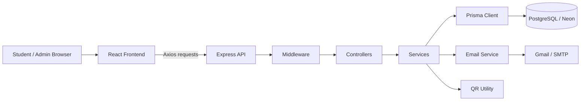
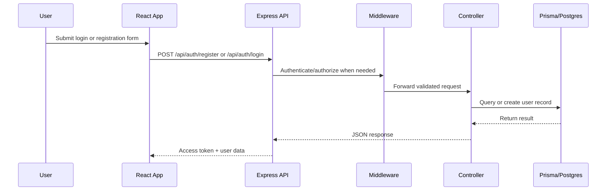
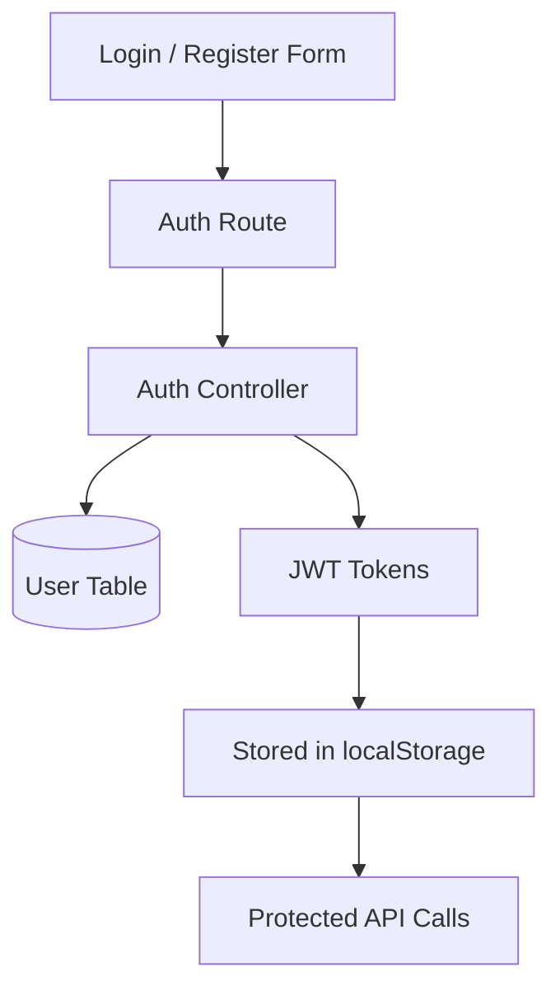
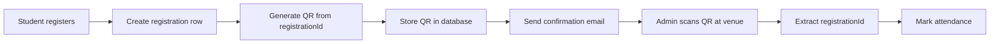
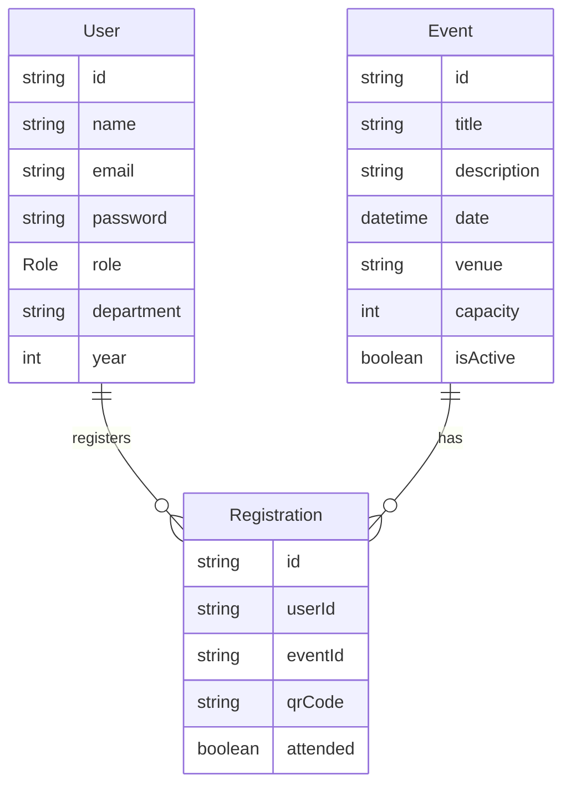

# College Event Management System

A full-stack web application for managing college events, registrations, QR-based attendance, and automated confirmation emails. The system is split into a React frontend and an Express + Prisma backend backed by PostgreSQL.

## Overview

This project is designed as a production-style system rather than a simple CRUD demo. It demonstrates:

- Role-based authentication with student and admin flows.
- Event browsing, registration, cancellation, and attendance tracking.
- QR code generation for check-in.
- Email confirmation on successful registration.
- Clean separation of concerns across routes, middleware, controllers, services, and utilities.

## Tech Stack

- Frontend: React, Vite, React Router, Axios, Tailwind CSS.
- Backend: Node.js, Express, TypeScript.
- Database: PostgreSQL.
- ORM: Prisma 7 with a PostgreSQL adapter.
- Authentication: JWT.
- Email: Nodemailer.
- QR generation: qrcode.

## System Architecture



### Request Lifecycle



## Folder Structure

### Backend

```text
backend/
	prisma/
		schema.prisma
		migrations/
	src/
		config/
		controllers/
		middleware/
		routes/
		services/
		utils/
		index.ts
```

### Frontend

```text
frontend/
	src/
		components/
		context/
		pages/
		services/
		App.jsx
		main.jsx
```

## Why This Architecture Works

The backend follows a modular design:

```text
request -> route -> middleware -> controller -> service -> database / utilities -> response
```

This structure is useful because it keeps authentication, request handling, business logic, and data access separated. That makes the codebase easier to test, extend, and debug.

### Responsibilities by Layer

- `routes`: define API endpoints and connect them to controller functions.
- `middleware`: handle auth, authorization, and request guards.
- `controllers`: process request/response flow and coordinate the call chain.
- `services`: contain reusable business logic such as email delivery.
- `config`: initialize external systems such as Prisma.
- `utils`: store helper functions such as QR generation.

## Authentication Flow



### Auth Behavior

- `register` creates a new student account.
- `login` validates email and password.
- JWT access tokens are used for protected routes.
- Admin users can access event management and attendance views.

## Core Modules

### 1. Authentication

- Student sign-up with name, email, password, department, and year.
- Login with JWT-based session handling.
- `/auth/me` route for restoring the logged-in user on page refresh.

### 2. Events

- Students can browse events and view details.
- Admins can create, update, delete, and manage events.
- Event visibility is controlled through `isActive`.

### 3. Registrations

- Students can register for events.
- Duplicate registration is blocked.
- Capacity checks prevent overbooking.
- Users can cancel upcoming registrations.

### 4. QR Attendance

- A QR code is generated from the registration ID.
- The QR code is stored against the registration record.
- Admins can scan and mark attendance from the QR-derived registration ID.

### 5. Email Notifications

- Registration confirmation emails are sent after successful registration.
- Emails include event details and the QR code image.

## QR Attendance Flow



## Frontend Data Strategy

The frontend uses a central Axios instance in `frontend/src/services/api.js` so every request shares the same base URL and token logic.

Why this pattern helps:

- One source of truth for the API base URL.
- Automatic token attachment for protected requests.
- Cleaner React pages and components.
- Easy environment-based deployment with `VITE_API_BASE_URL`.

## API Endpoints

### Auth

- `POST /api/auth/register`
- `POST /api/auth/login`
- `GET /api/auth/me`

### Events

- `GET /api/events`
- `GET /api/events/:id`
- `POST /api/events`
- `PUT /api/events/:id`
- `DELETE /api/events/:id`
- `GET /api/events/admin/all`

### Registrations

- `POST /api/registrations/register`
- `GET /api/registrations/my-registrations`
- `DELETE /api/registrations/:id`
- `GET /api/registrations/event/:eventId`
- `POST /api/registrations/attendance`

## Database Model

The Prisma schema models three core entities:

- `User`: students and admins.
- `Event`: event metadata and capacity.
- `Registration`: join table between users and events with attendance and QR fields.

### Relationship Summary



## Environment Variables

### Backend

- `PORT` - server port.
- `DATABASE_URL` - PostgreSQL connection string.
- `JWT_SECRET` - token signing secret.
- `EMAIL_USER` - sender email address.
- `EMAIL_PASS` - email app password.

### Frontend

- `VITE_API_BASE_URL` - deployed backend API base URL.

## Local Development

### Backend

```bash
cd backend
npm install
npx prisma generate
npx prisma migrate dev
npm run dev
```

### Frontend

```bash
cd frontend
npm install
npm run dev
```

## Production Deployment

### Backend on Render

Use `backend` as the root directory.

Build command:

```bash
npm install && npx prisma generate --schema=prisma/schema.prisma && npx prisma migrate deploy --schema=prisma/schema.prisma && npm run build
```

Start command:

```bash
npm run start
```

Set backend environment variables in Render, especially `DATABASE_URL` pointing to Neon.

### Frontend on Vercel or Netlify

Set:

```bash
VITE_API_BASE_URL=https://<your-render-backend>/api
```

Then redeploy the frontend so the production build picks up the new API URL.

## Future Improvements

- Email resend queue with background jobs.
- Event search and filtering by date, department, and capacity.
- Audit logs for admin actions.
- Dashboard analytics for registrations and attendance trends.
- WebSocket-based live attendance count updates.

## Project Summary

This project demonstrates a real-world full-stack architecture with authentication, role-based access, event operations, automated QR generation, and production deployment readiness. It is a strong example of how to structure a maintainable and scalable application.
